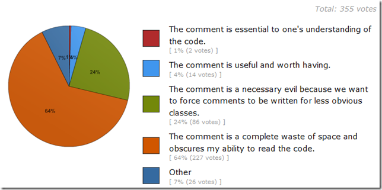

!SLIDE 
# Once a measure becomes a target, it loses value.

!SLIDE
# Code Metrics

!SLIDE bullets incremental
# Code Coverage
* MUST BE 100%
* ALWAYS
* FOREVER
* j/k

!SLIDE
# Cyclomatic Complexity
### less than 10 (please)

    @@@csharp
    if (c1())
      f1();
    else
      f2();

    if (c2())
      f3();
    else
      f4();

!SLIDE
# CRAP
### Change Risk Analysis Predictions
### CRAP(m) = comp(m)^2 * (1 – cov(m)/100)^3 + comp(m)
### less than 30 (please)

!SLIDE
# Maintainability Index (VS)
### [Formula](http://blogs.msdn.com/b/codeanalysis/archive/2007/11/20/maintainability-index-range-and-meaning.aspxu)
### Based on Halstead Volume (# operators), Cyclomatic Complexity, Lines of Code

!SLIDE center

!SLIDE bullets
# Coupling/Cohesion

* Efferent
* Afferent
* Depth of inheritance

!SLIDE center
# Comments/LoC

!SLIDE
# Did I miss any you use?

